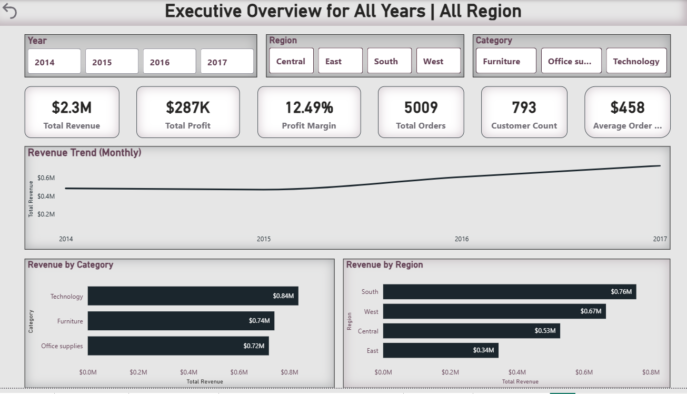
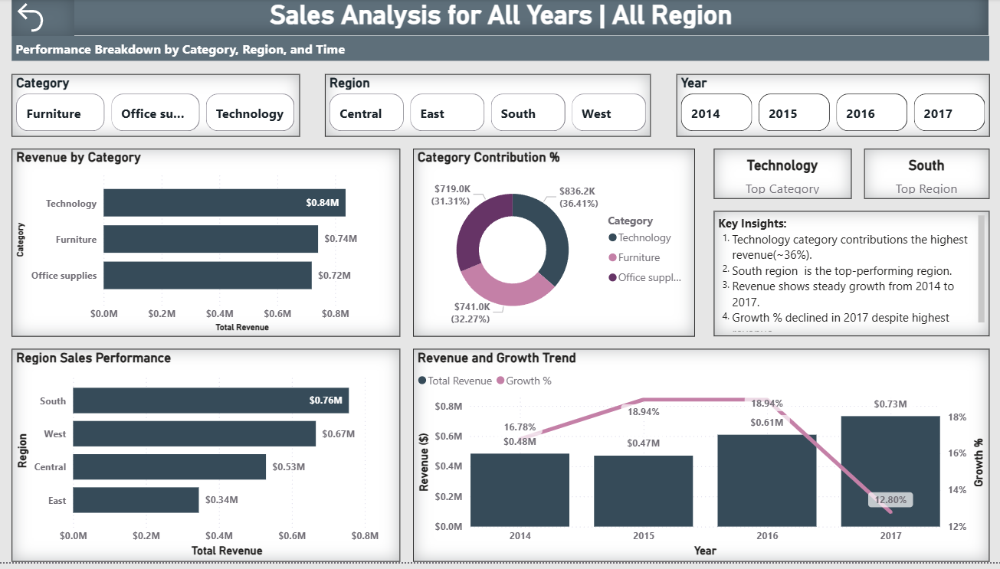
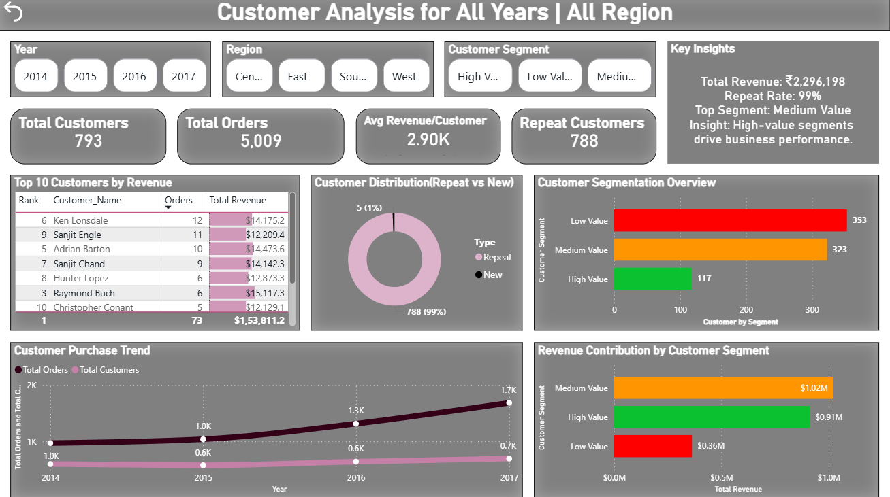
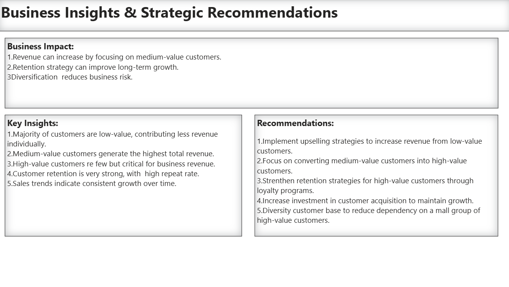

# E-Commerce Sales Analysis & Business Intelligence Dashboard

## Problem Statement
E-commerce businesses generate large volumes of transactional data, but without proper analysis, it becomes difficult to extract meaningful insights.
The dataset covers E-commerce transactions from 2014 to 2017, allowing analysis of sales trends, customer behavior, and business performance over time.
The key challenges addressed in this project include:
- Identifying top-performing products and categories
- Understanding customer purchasing behaviour
- Analysing regional sales performance
- Tracking revenue and profit trends over time
This project aims to transform raw data into actionable insights using SQL and Power BI.

## Tools used
- Power BI  -Dashboard creation
- SQL       -Data analysis & querying

## Dashboard Overview
The Power BI dashboard consists of 4 pages:
- Executive Overview
- Sales Analysis
- Customer Analysis
- Business Insights & Strategic Recommendation

## Key Insights
- Revenue is highly concentrated among high-value customers
- Repeat customers contribute significantly to total sales
- Sales performance varies across regions
- Certain product categories outperform others consistently
- Revenue trends indicate seasonal fluctuations
- Profit margins vary across categories and regions

## Recommendations
- Focus marketing on high-performing regions
- Improve sales in underperforming segments
- Retain top customers with loyalty programs
- Optimise inventory for high-demand products

## Files Included
- SQL Queries
- Clean Dataset
- Power BI Dashboard

## Dashboard Screenshots
### Executive Overview

### Sales Analysis

### Customer Analysis

### Business Insights & Strategic Recommendations

## Project Structure
- **1_Raw_Data/**     -Raw dataset
- **2_SQL_Scripts/**  -SQL analysis queries
- **3_Cleaned_Data/** -Cleaned dataset
- **4_PowerBi/**      -Dashboard file and screenshots 

## Conclusion
This project demonstrates the use of Power BI for business intelligence, enabling data-driven decision-making through interactive dashboards.

## Project Report
[Download Full Report](6_ECommerce_Sales_Analysis.pdf)

